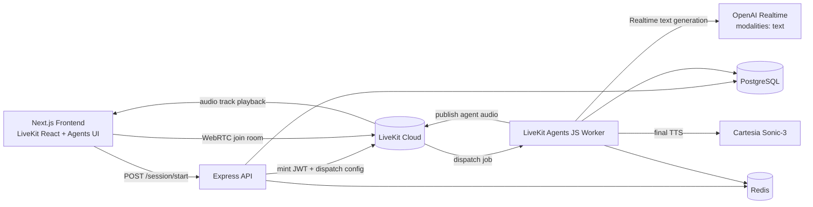

# How to build a production-ready voice agent platform with LiveKit, OpenAI Realtime, Cartesia, and Node.js

This repository is a production-oriented TypeScript monorepo that implements a real-time voice agent platform with:

- LiveKit for WebRTC media transport and room orchestration
- LiveKit Agents JS SDK for backend worker runtime
- OpenAI Realtime for low-latency speech understanding + response generation
- Cartesia Sonic-3 as a separate final TTS layer
- Express API for session creation and LiveKit access token minting
- PostgreSQL for persistent session/transcript/tool/outcome storage
- Redis for ephemeral session/workflow state

The key architecture choice is **half-cascade**:

- We do **not** run a full STT -> LLM -> TTS chain manually.
- We do **not** allow OpenAI Realtime to produce final audio.
- We run OpenAI Realtime in **text-only modality** and keep final speech synthesis in Cartesia.

---

## Table of contents

1. [Architecture at a glance](#architecture-at-a-glance)
2. [Monorepo structure](#monorepo-structure)
3. [End-to-end request flow](#end-to-end-request-flow)
4. [What each app does](#what-each-app-does)
5. [SDK usage map](#sdk-usage-map)
6. [Data model and persistence](#data-model-and-persistence)
7. [Local setup](#local-setup)
8. [Run and verify](#run-and-verify)
9. [Troubleshooting](#troubleshooting)
10. [Deployment notes](#deployment-notes)
11. [Security and production hardening](#security-and-production-hardening)
12. [Article outline you can reuse](#article-outline-you-can-reuse)

---

## Architecture at a glance



Why this works well:

- LiveKit handles jitter, track routing, reconnection, and room semantics.
- OpenAI Realtime handles fast conversational reasoning.
- Cartesia gives a dedicated, controllable voice layer.
- API + worker split keeps control plane separate from media/runtime plane.

---

## Monorepo structure

```txt
voice-agent-platform/
  apps/
    frontend/   # Next.js + LiveKit React starter-style voice UI
    server/     # Express API: health + session/token endpoint
    worker/     # LiveKit Agents JS runtime + model/tts/tools
  packages/
    shared/     # shared zod contracts + logging utilities
    config/     # env loading + validation helpers
```

---

## End-to-end request flow

1. User opens frontend (`apps/frontend`) and clicks connect/start.
2. Frontend calls `POST /session/start` on API server.
3. API validates request, creates session row in Postgres, stores ephemeral state in Redis.
4. API mints LiveKit participant JWT and includes room dispatch metadata (`agentName`).
5. Frontend receives `{ token, livekitUrl, roomName, sessionId, expiresAt }`.
6. Frontend joins LiveKit room over WebRTC.
7. LiveKit dispatches worker job to the registered worker process.
8. Worker joins room as agent participant.
9. Worker starts `AgentSession`:
   - LLM: `openai.realtime.RealtimeModel({ modalities: ['text'] })`
   - TTS: `inference.TTS({ model: 'cartesia/sonic-3', ... })`
10. User speech is processed in real time; agent generates text and Cartesia synthesizes final audio.
11. Agent audio is published back to room and played in browser.
12. Transcript/tool/outcome events are persisted in Postgres; short-lived context lands in Redis.

---

## What each app does

## 1) Frontend (`apps/frontend`)

Current frontend follows the **React starter app model** (Next.js + Agents UI components):

- Session lifecycle via `useSession(...)`
- Token retrieval via `TokenSource.custom(...)`
- Agent UX components (visualizer, control bar, transcript, start-audio UX)

Important file:

- `apps/frontend/components/app/app.tsx`

What happens there:

- Creates a token source that calls your backend `/session/start`
- Converts server response into LiveKit token-source format:
  - `serverUrl`
  - `participantToken`
- Starts a LiveKit session with optional `agentName` dispatch

## 2) API server (`apps/server`)

- `GET /health` for service liveness
- `POST /session/start` for room + token bootstrap

Important file:

- `apps/server/src/controllers/session.controller.ts`

The endpoint:

- validates payload with Zod
- persists session record
- mints LiveKit token via `livekit-server-sdk`
- returns room/token/URL metadata to frontend

## 3) Worker (`apps/worker`)

Important file:

- `apps/worker/src/agent/entry.ts`

Worker responsibilities:

- Join dispatched room (`defineAgent` + job context)
- Resolve persisted session UUID by room name for DB-safe writes
- Start `voice.AgentSession` with OpenAI Realtime text-only + Cartesia TTS
- Register and execute tools (e.g. availability checker)
- Write transcript/tool/outcome events to Postgres

---

## SDK usage map

## LiveKit client SDK + React components

Used in frontend:

- `livekit-client` (TokenSource and core room session primitives)
- `@livekit/components-react` (Session hook, UI controls, voice/session state)

## LiveKit server SDK

Used in API server:

- `livekit-server-sdk` for JWT minting and grants

## LiveKit Agents JS SDK

Used in worker:

- `@livekit/agents`
- `defineAgent(...)`
- `voice.AgentSession`
- worker process startup via `cli.runApp(...)`

## OpenAI Realtime plugin

Used in worker:

- `@livekit/agents-plugin-openai`
- `openai.realtime.RealtimeModel(...)`

Configured with:

- `modalities: ['text']`

## Cartesia Sonic-3 TTS

Used in worker via LiveKit inference:

- `inference.TTS({ model: 'cartesia/sonic-3', voice, language })`

---

## Data model and persistence

Schema file:

- `apps/server/src/db/schema.sql`

Tables:

- `sessions`
- `transcript_events`
- `tool_events`
- `outcomes`

Design intent:

- `sessions`: canonical lifecycle + room identity
- `transcript_events`: append-only conversational trace
- `tool_events`: observability for external side effects
- `outcomes`: structured final/derived states per session

Redis usage:

- ephemeral auth/session/workflow context
- caches short-lived runtime state

---

## Local setup

Prerequisites:

- Node.js 20+
- PostgreSQL 14+
- Redis 7+
- LiveKit Cloud project
- OpenAI API key (Realtime-enabled)

## 1) Environment files

```bash
cp apps/server/.env.example apps/server/.env
cp apps/worker/.env.example apps/worker/.env
cp apps/frontend/.env.example apps/frontend/.env
```

Fill required values:

- `LIVEKIT_URL`
- `LIVEKIT_API_KEY`
- `LIVEKIT_API_SECRET`
- `OPENAI_API_KEY`
- `DATABASE_URL`
- `REDIS_URL`
- `NEXT_PUBLIC_API_BASE_URL` (frontend)

## 2) Install dependencies

```bash
npm install
```

## 3) Start Postgres + Redis

Example with Homebrew:

```bash
brew services start postgresql@14
brew services start redis
```

## 4) Apply DB schema

```bash
psql "$DATABASE_URL" -f apps/server/src/db/schema.sql
```

---

## Run and verify

Start all apps:

```bash
npm run dev
```

Expected:

- Frontend (Next.js): `http://localhost:3000`
- API server listening on `:4000`
- Worker logs `registered worker`

Quick live checks:

1. Start stack and confirm boot logs.
2. Create session via API:

```bash
curl -s -X POST http://localhost:4000/session/start \
  -H 'content-type: application/json' \
  -d '{"userId":"livecheck-user","channel":"web","context":{"timezone":"Africa/Nairobi","locale":"en-US"}}'
```

3. Open `http://localhost:3000`, connect, speak, and confirm:

- worker receives job request
- worker joins room
- UI transitions through agent states
- transcript/tool logs appear

---

## Troubleshooting

## Error: `invalid input syntax for type uuid`

Cause:

- writing `roomName` into UUID `session_id` columns.

Fix in this repo:

- worker resolves real session UUID by `room_name` before DB writes.

## Frontend connects but no agent response

Check:

- worker registered and receiving jobs
- `AGENT_NAME` / dispatch name consistency
- OpenAI key configured in worker env

## App "works" without OpenAI key

Usually means:

- key still present in env file
- process not restarted after key change

Confirm by clearing key, restarting worker, and verifying boot-time env validation fails.

## Token endpoint errors from frontend

Check:

- `NEXT_PUBLIC_API_BASE_URL` points to running API
- server returns valid JSON with `token` and `livekitUrl`

---

## Deployment notes

Server and worker have Dockerfiles:

- `apps/server/Dockerfile`
- `apps/worker/Dockerfile`

Deploy services independently:

- frontend (Next.js hosting)
- API service
- worker service
- managed Postgres + Redis

Recommended production topology:

- private worker network access to DB/Redis
- API behind auth/rate limit layer
- secret manager for all credentials

---

## Security and production hardening

Important:

- Rotate any API keys that were shared in plaintext.
- Add real auth in `/session/start` (JWT/session introspection).
- Add authorization scopes for tool access.
- Add per-user/session rate limits.
- Add OpenTelemetry tracing + request correlation IDs.
- Add retry/backoff + dead-letter strategy for critical writes.
- Add data retention policies for transcript/tool events.

---

## Article outline you can reuse

Title:

- **How to build a production-ready voice agent platform with LiveKit, OpenAI Realtime, Cartesia, and Node.js**

Suggested sections:

1. Why half-cascade beats naive full pipelines for real-time voice UX
2. System architecture: transport, intelligence, synthesis, storage
3. Building the control plane (`/session/start`) with LiveKit token dispatch
4. Implementing the media/runtime plane with LiveKit Agents JS
5. Integrating OpenAI Realtime in text-only mode
6. Integrating Cartesia Sonic-3 as dedicated TTS
7. Tool calling, validation, and persistence strategy
8. Observability and state transitions that matter in production
9. Failure modes and how this architecture mitigates them
10. Deployment topology and hardening checklist

---

If you want, I can also generate a matching `docs/article-draft.md` with screenshots/log snippets placeholders so you can publish faster.
